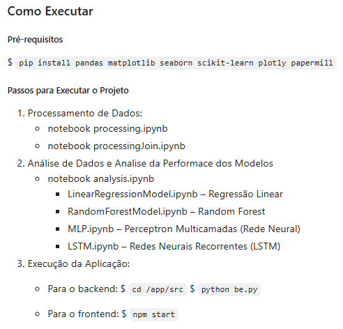
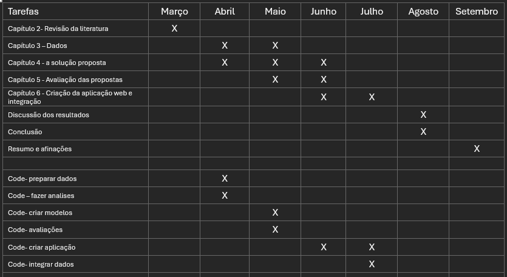

# AI-Powered-Real-Estate-Analytics-for-Investors

<table>
  <tr>
    <td align="center">
      
    </td>
    <td align="center">
      <strong>Processo de construção do projeto</strong> 
      
    </td>
  </tr>
</table>

<!--
### Como Executar
##### Pré-requisitos
$ `pip install pandas matplotlib seaborn scikit-learn plotly papermill`

##### Passos para Executar o Projeto
1. Processamento de Dados:
   - notebook processing.ipynb
   - notebook processingJoin.ipynb
5. Análise de Dados e Analise da Performace dos Modelos
   - notebook analysis.ipynb
     - LinearRegressionModel.ipynb – Regressão Linear
     - RandomForestModel.ipynb – Random Forest
     - MLP.ipynb – Perceptron Multicamadas (Rede Neural)
     - LSTM.ipynb – Redes Neurais Recorrentes (LSTM)
3. Execução da Aplicação:
   - Para o backend:
      $ `cd /app/src`
      $ `python be.py`
    
   - Para o frontend:
      $ `npm start`
-->

##### Estrutura de Arquivos
- dadosFinais.json: contém os dados principais para análise.
- localizacao.json: contém as localizações dos imóveis.
- housesData.json: contém informações detalhadas sobre os imóveis.
- resultadosModelos.json: contem os resultados de diferentes modelos preditivos

### Resumo da proposta de TFM:
O mercado imobiliário desempenha um papel significativo na economia e nas estratégias de investimento tanto nos países como no mundo. Seja nas áreas de habitação, investimento ou desenvolvimento, o mercado imobiliário é influenciado por uma ampla gama de fatores desde as condições econômicas até às tendências demográficas, passando pelo custo de vida e ciclos de mercado.

O projeto concentra-se no desenvolvimento de uma aplicação web de análises abrangentes, destacando as características de cada imóvel, contextualiza o mercado em que esses imóveis estão localizados e explora a interconexão entre o mercado imobiliário e os fatores econômicos que influenciam esses mercados. Isso permite uma análise avançada para aprimorar as previsões das evoluções dos mercados imobiliários.

Os objetivos centrais deste projeto incluem a avaliação fundamental das propriedades (avaliação das características da propriedade), a análise das tendências de mercado, com foco nas previsões de preços, bem como a avaliação dos fatores econômicos que influenciam os mercados imobiliários. Com base nestes fatores, a aplicação pretende por fim identificar oportunidades de investimento.
Palavras-chave: Real Estate; SQL; Python; Machine Learning; Deep Learning; Web Application; User Experience (UI/UX); 

O projeto seguirá os seguintes passos:
-	Realização de uma análise inicial abrangente para compreender o problema, estruturá-lo e desenvolver a arquitetura da aplicação.
-	Construção de uma base de dados por meio da integração de dados provenientes de API’s, outras bases de dados e/ou fontes adicionais.
-	Desenvolvimento de scripts automatizados para manter a base de dados atualizada.
-	Realização de Análise Exploratória de Dados (EDA) e Engenharia/Extração de Características.
-	Construção de modelos de machine learning e deep learning para abordar os problemas e realizar previsões.
-	Avaliação dos modelos usando métricas de desempenho e seleção dos modelos mais adequados.
-	Compreensão da Explicabilidade e da Interoperabilidade do melhor modelo, garantindo transparência nas decisões do sistema.
-	Desenvolvimento da Interface de utilizador (UI) com foco na experiência do utilizador, garantindo uma interação intuitiva e eficaz.
-	Implementação da lógica que conecta a base de dados com a interface de utilizador, garantindo a integridade e a atualização dos dados.

Objetivos de analise da plataforma:
-	Avaliação fundamental das Propriedades.
-	Análise de Tendências de Mercado (Previsões de Preços).
-	Avaliação de fatores económicos dos mercados e como estes são afetados.
-	Identificação de Oportunidades de Investimento com base nas tendências de mercado.

# Calendario Da TFM

